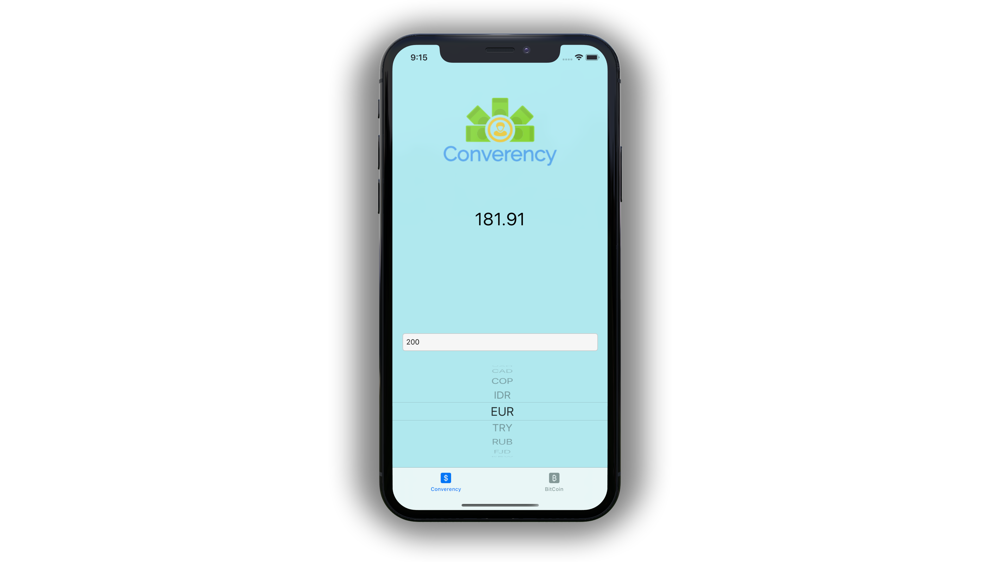
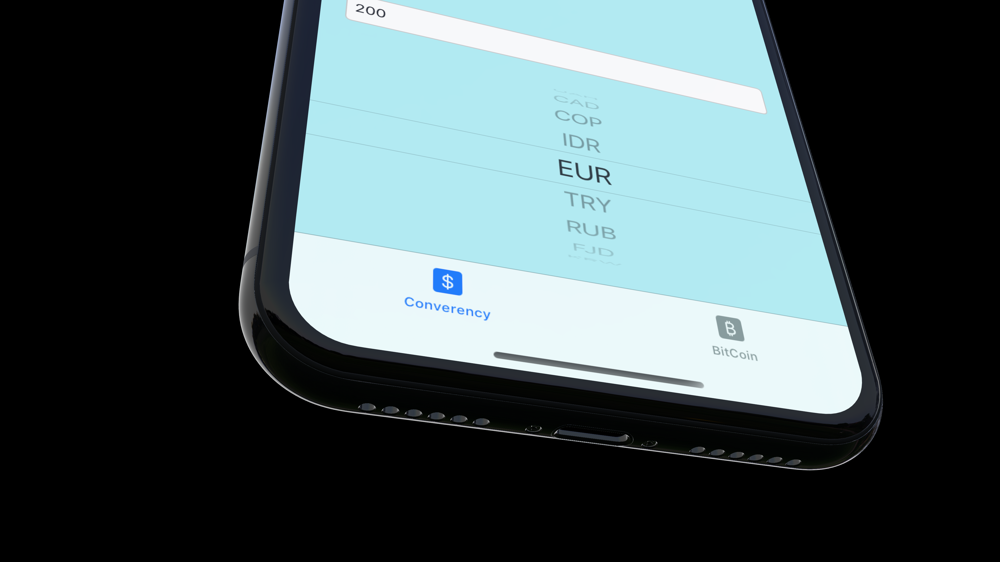

# Overview
Converency is an easy to use app for getting up-to-date exchange rates on foreign currencies & cryptocurrencies.

  

# Screenshots
 
 

# Usability

With its clean aesthetic, it's an __absolute breeze__ to use Converency. You just type in the amount and select the currency you would like it converted to. The price label automatically changes so there's no need to constantly press a convert button. Switching between foreign currency and cryptocurrency is easy as well, just tap on either of the icons located at the bottom.

# SwiftUI Version
I have recreated [Converency](https://github.com/EnriqueG24/SwiftUIBitcoinTracker) in SwiftUI as well if you would like to take a look. 
